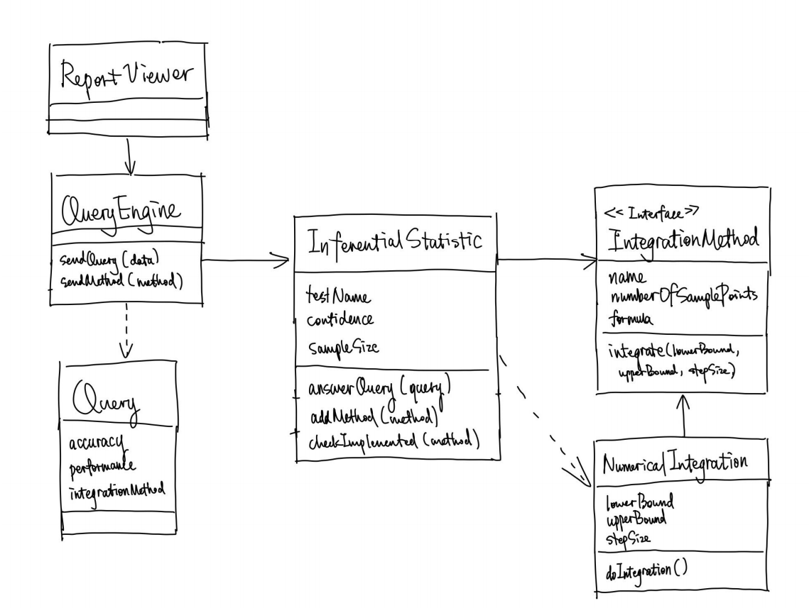
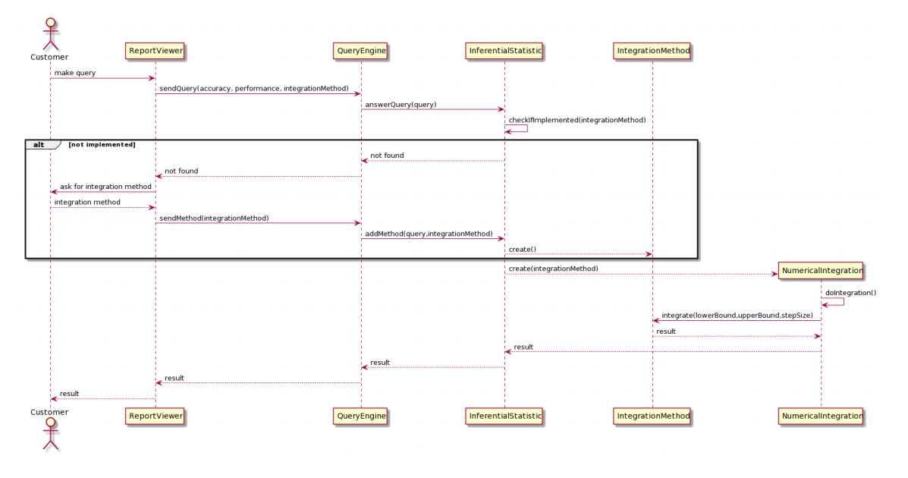

# Part 1 Peer Review

## Date -- 4/29/2020

## Final Class Diagram

## Final Sequence Diagram

## Discussion

### To what extent did the peer’s design function?

It functioned, but required a decent amount of change on my end to get it to work. There were a couple issues that would have caused compile errors; the
interface had fields in it and there needed to be parameters passed into the integrationMethod(). Additionally, there was no main method, so I was confused
on where the program would actually start. Lastely, there were no actual implementations of the IntegrationMethod interface. These were all minor issues that
I was able to fix, but it did require a fair amount of code to be changed from the initial class diagram.

### To what extent did the design favor composition over inheritance?

The initial design didn't favor composition over inheritance for a simple reason; there were no actual implementations of the IntegrationMethod class. If there
were implementations of IntegrationMethod, then it would have favored composition over inheritance.

### To what extent did the design program to interfaces?

The design did a good job programming to interfaces. It used the IntegrationMethod interface to hold the integrate() method, and the NumericalIntegration class
had a reference to that interface. One small issue was that the design gave the interface some fields, which is wrong, so I removed them.

### To what extent was the design loosely coupled? Were there any trainwrecks?

This question is somewhat difficult to answer, because there are really only two classes in the class diagram that mattered to actually calculate
integration. So in terms of those two classes, yes the are loosely coupled and there were no trainwrecks. There was only one association between NumericalIntegration and IntegrationMethod.
But again, keep in mind that only two of the seven classes shown in the class diagram actually had to do with calculating integrals.

### To what extent was the design cohesive? Did it violate Single Responsibility Principle anywhere?

The design was very cohesive. Both the NumericIntegration class and the IntegrationMethod class have **only one reason to change.** They both carry out one
responsibility and 

### Was there anything that your peer’s design/notebook lacked that would have made life easier for you?

Yes. I don't think it was necessary to include the classes that were not related to the actual Numeric Integration layer of the architecture. Additionally,
there should not have been fields inside of the interface class. Finally, it would have been easier to understand if there was at least one concrete implementation
of the IntegrationMethod.

### In retrospect: was there anything that your notebook was lacking that would have made life easier for someone else?

Yes. I probably should have noted that my ConcreteImplentations of the IntegrationMethod were not actually going to be the concrete implementations, they were
just there to be placeholders.