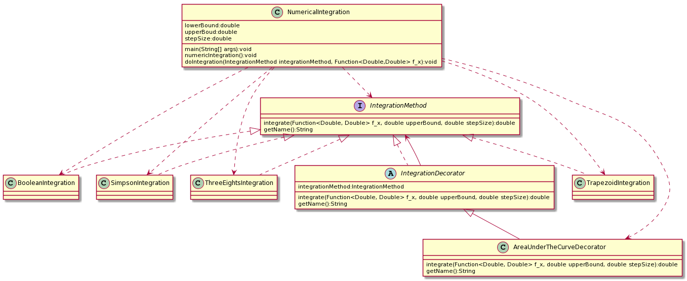
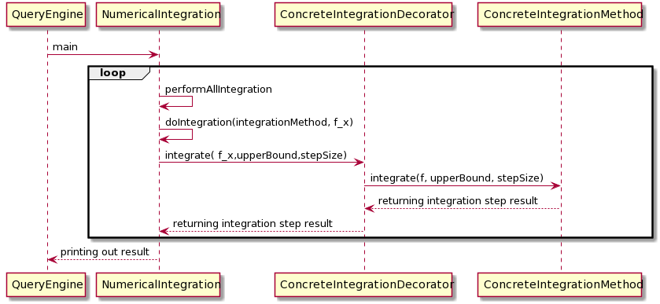

# Part 1 Peer Review

## Date -- 4/29/2020

## Final Class Diagram

## Final Sequence Diagram

## Discussion

### To what extent did the peer’s design function?

It functioned, but required a decent amount of change on my end to get it to work. There were a couple issues that would have caused compile errors; the
interface had fields in it and there needed to be parameters passed into the integrationMethod(). Additionally, there was no main method, so I was confused
on where the program would actually start. Lastely, there were no actual implementations of the IntegrationMethod interface. These were all minor issues that
I was able to fix, but it did require a fair amount of code to be changed from the initial class diagram.

### To what extent did the design favor composition over inheritance?

The initial design didn't favor composition over inheritance for a simple reason; there were no actual implementations of the IntegrationMethod class. If there
were implementations of IntegrationMethod, then it would have favored composition over inheritance.

### To what extent did the design program to interfaces?

The design did a good job programming to interfaces. It used the IntegrationMethod interface to hold the integrate() method, and the NumericalIntegration class
had a reference to that interface. One small issue was that the design gave the interface some fields, which is wrong, so I removed them.

### To what extent was the design loosely coupled? Were there any trainwrecks?

Yes, this design is loosely coupled. There are a few dependencies between NumericalIntegrtaion and the actual implementations of the IntegrationMethod interface,
but this is expected. There are certainly not any unused dependencies or associations between any class or interfaces, and there were no trainwrecks.

### To what extent was the design cohesive? Did it violate Single Responsibility Principle anywhere?

The design was very cohesive. Both the NumericIntegration class and the IntegrationMethod class have **only one reason to change.** They both carry out one
responsibility and demonstrated high cohesion. Additionally, each IntegrationMethod implementation had one integrate() method to properly perform it's
respective integration method.

### Was there anything that your peer’s design/notebook lacked that would have made life easier for you?

Yes. I don't think it was necessary to include the classes that were not related to the actual Numeric Integration layer of the architecture. Additionally,
there should not have been fields inside of the interface. Finally, it would have been easier to understand if there was at least one concrete implementation
of the IntegrationMethod.

### In retrospect: was there anything that your notebook was lacking that would have made life easier for someone else?

Yes. I probably should have noted that my ConcreteImplentations of the IntegrationMethod were not actually going to be the real concrete implementations, they were
just there to be placeholders.

### Time Spent - 3 hours (includes implementing the actual design)

# Part 2 Decorator

## Date -- 4/30/2020

### Candidate Design 1

For my first candidate design, I propose that we give the IntegrationMethod interface an abstract decorator called **IntegrationDecorator**. That abstrct decorator will have
one concrete Decorator implementation, called AreaUnderTheCurveDecorator. In the AreaUnderTheCurverDecorator's integrate method, it will call Math.abs(integrate()),
so that the integrals are properly calculated.

#### Pros

This approach will do a very good job of **adding additional responsibilities to an object dynamcially.** Additionally, this design will allows us to add on additional
functionality to our integration methods in the future. Also, we don't have to change **any existing code** to add on the decorators.

#### Cons

We will have to add additional an additional dependency between the NumericanIntegration class and the actual AreaUnderTheCurveDecorator. Also if this ends up being
our only additional functionality added to the IntegrationMethod, than this would be an overall design decision, and you could simply override the integrate
method in another class to do the job with less code. However, it is likely that the design will in fact change in the future.

### Candidate Design 2

For the second candidate design, we could give the NumericalIntegration class a decorator. Specifically, we could decorate the doIntegration() method so that
it would add the absolute value to each integration step.

#### Pros
The pros to this approach are almost identical to the pros for the Candidate Design 1. The only different pro is that this approach will be able add
is the fact that we are going to decorate the doIntegrate() method instead of the integrate() method inside of the IntegrationMethod interface.
This approach also does a good job of **adding additional responsibilities to an object dynamcially.** We also won't have to **change any existing code.**

#### Cons

Again, this adds additional dependencies into our system. However a larger con is that this does not end up changing the functionality of the integrate() method.
Instead, it more focuses on **changing the bounds of integration**. This would make it much more difficult for the client to properly set the bounds and step
size to accurately get the area under the curve.

### Preference

I prefer the first design because it is better geared towards actually changing the value returned by the intergration method. We will have a greater flexibility
on the ability the change what values will be returned by the integrate() method. This also does a better job of adding additional behavior without changing underlying code.

### Sketch of Class & Sequence Diagrams

#### Class Diagram

#### Sequence Diagram

### Citations

https://ramj2ee.blogspot.com/2013/12/decorator-design-pattern-sequence.html

https://www.softwareideas.net/a/391/Decorator-Design-Pattern--UML-Diagrams-

https://www.visual-paradigm.com/tutorials/decoratordesignpattern.jsp

### Time Spent -- 2 hours